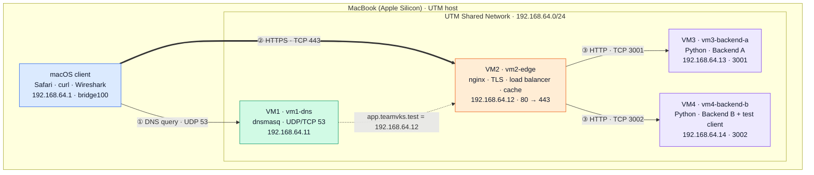
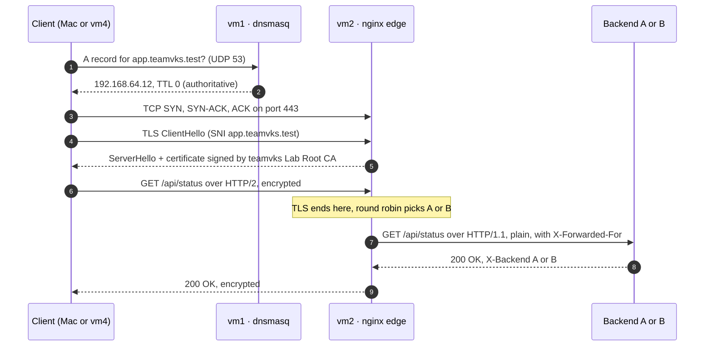
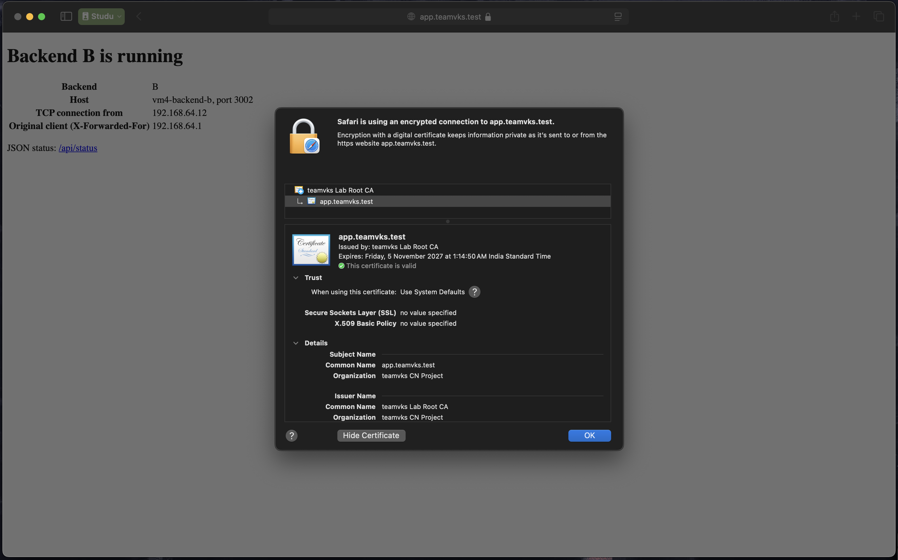
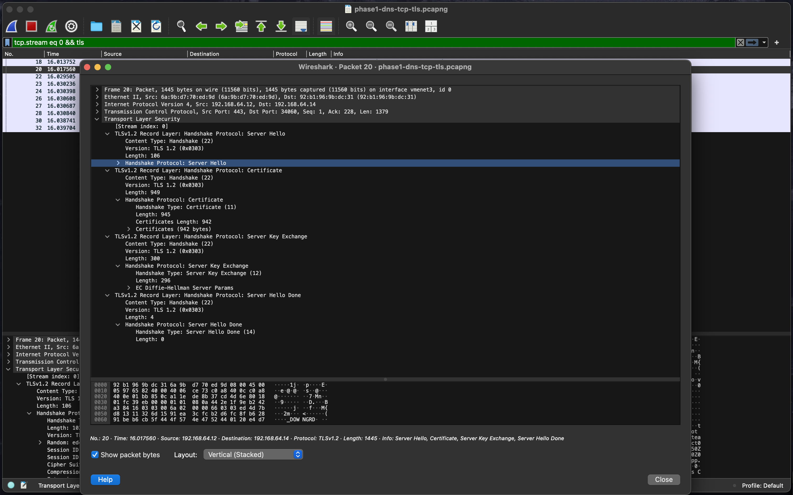

# CN Private Network Service Platform


A Computer Networks course project (Section D) that builds a small private "cloud" on one MacBook. A client opens **`https://app.teamvks.test`**:

- our own **DNS server** resolves the name;
- an **nginx edge** terminates TLS with a certificate from our own CA;
- nginx **load-balances** the request across **two backends**;
- **Wireshark** shows every step on the wire.

> The application stays simple. The network is the project.

**Contents:** [Team](#team) · [Architecture](#architecture) · [Lab inventory](#lab-inventory) · [What each layer does](#what-each-layer-does) · [See it work](#see-it-work) · [How to run the backends](#how-to-run-the-backends) · [Build it yourself](#build-it-yourself) · [Evidence](#phase-1-evidence) · [Repository layout](#repository-layout) · [Security](#security-notes)

## Team

| Name | Enrollment No. | Work mode |
| --- | --- | --- |
| Gokul VKS | 2401020094 | Solo |

**Submission type:** Type 3. Four Ubuntu Server 24.04 (ARM64) virtual machines in **UTM** on an Apple Silicon MacBook stand in for the brief's four Macs.

## Architecture



**One request, end to end** (`curl https://app.teamvks.test/api/status`):



The client only ever knows the **name** and the **edge**. The backends can change without any client noticing; that's the job of a load balancer. A deeper write-up (OSI layer map, cloud equivalents, single points of failure) is in [docs/architecture.md](docs/architecture.md). A one-page visual overview is in [docs/showcase.html](docs/showcase.html).

## Lab inventory

| VM | Brief role | Hostname | Address | Interface · MAC | Service |
| --- | --- | --- | --- | --- | --- |
| VM1 | Mac 1: DNS server | `vm1-dns` | 192.168.64.11/24 | `enp0s1` · `ce:6c:90:a5:66:5a` | dnsmasq, 53/UDP+TCP |
| VM2 | Mac 2: edge + load balancer | `vm2-edge` | 192.168.64.12/24 | `enp0s1` · `6a:9b:d7:70:ed:9d` | nginx, 80 → 443/TCP |
| VM3 | Mac 3: Backend A | `vm3-backend-a` | 192.168.64.13/24 | `enp0s1` · `7a:14:d5:23:b0:70` | Python REST, 3001/TCP |
| VM4 | Mac 4: Backend B + client | `vm4-backend-b` | 192.168.64.14/24 | `enp0s1` · `92:b1:96:9b:dc:31` | Python REST, 3002/TCP |
| Host | UTM host, browser, Wireshark | macOS | 192.168.64.1/24 | `bridge100` | gateway + NAT for the VMs |

Private records: `app.teamvks.test` and `api.teamvks.test` → `192.168.64.12` (the edge, never a backend). `.test` is reserved (RFC 2606), so public DNS answers NXDOMAIN.

## What each layer does

| Layer | Protocol | Where in this project | Proof |
| --- | --- | --- | --- |
| Application | DNS | dnsmasq on vm1 answers `*.teamvks.test`, forwards other names to the Mac | [A3 dig](evidence/phase1/A-lan-dns/A3-dig-app-from-vm4.txt) |
| Application | HTTP/1.1 · HTTP/2 | HTTP/2 client → edge, HTTP/1.1 edge → backends | [access log](evidence/phase1/B-https-lb/E-access-log-https.txt) |
| Security | TLS 1.2 / 1.3 | terminated at nginx; certificate from our own CA (`tls/`) | [curl -v](evidence/phase1/B-https-lb/E-B1-curl-v.txt) |
| Transport | TCP · UDP | TCP 443 / 3001 / 3002, UDP 53 | [TCP handshake](evidence/phase1/C-wireshark/C2-tcp-handshake.txt) |
| Network | IPv4 | static addresses in 192.168.64.0/24, gateway .1 | [inventory](evidence/phase1/A-lan-dns/A1-inventory.txt) |
| Link | Ethernet | UTM virtual switch; ARP maps IP → MAC | [ARP table](evidence/phase1/A-lan-dns/A5-arp-table-vm1.txt) |

| Feature | How |
| --- | --- |
| Load balancing | nginx `upstream` with both backends, round-robin; `max_fails=1 fail_timeout=10s` + `proxy_next_upstream` skip a dead backend |
| Client identity behind the proxy | nginx adds `X-Forwarded-For`, `X-Real-IP`, `X-Forwarded-Proto` |
| Caching | `/api/info`: `Cache-Control: public, max-age=60`, `ETag`, `304 Not Modified`; the edge caches it too (`X-Cache-Status: MISS / HIT / REVALIDATED`) |
| Plain HTTP | port 80 answers `301` → `https://` |

## See it work

Real output from the lab (run on vm4 or the Mac; never with `curl -k`).

**DNS** resolves through our own server:

```text
$ dig app.teamvks.test
;; ->>HEADER<<- opcode: QUERY, status: NOERROR, id: 33458
app.teamvks.test.	0	IN	A	192.168.64.12
;; SERVER: 192.168.64.11#53(192.168.64.11) (UDP)
```

**HTTPS** is verified against our CA:

```text
$ curl -v https://app.teamvks.test
* Connected to app.teamvks.test (192.168.64.12) port 443
* SSL connection using TLSv1.3 / TLS_AES_256_GCM_SHA384 / X25519 / RSASSA-PSS
*  subjectAltName: host "app.teamvks.test" matched cert's "app.teamvks.test"
*  issuer: CN=teamvks Lab Root CA; O=teamvks CN Project
*  SSL certificate verify ok.
< HTTP/2 200
< x-backend: A
```

**Load balancing** alternates between the backends:

```text
$ for i in 1 2 3 4 5 6; do curl -s https://app.teamvks.test/api/status; done
{"backend": "B", "status": "ok", "host": "vm4-backend-b"}
{"backend": "A", "status": "ok", "host": "vm3-backend-a"}
{"backend": "B", "status": "ok", "host": "vm4-backend-b"}
{"backend": "A", "status": "ok", "host": "vm3-backend-a"}
{"backend": "B", "status": "ok", "host": "vm4-backend-b"}
{"backend": "A", "status": "ok", "host": "vm3-backend-a"}
```

**Caching**: the edge answers repeats by itself, and a conditional request gets `304`:

```text
$ curl -sI https://app.teamvks.test/api/info
HTTP/2 200
cache-control: public, max-age=60
etag: "2f9bf8e0a1ee62ec"
x-cache-status: MISS
$ curl -sI -H 'If-None-Match: "2f9bf8e0a1ee62ec"' https://app.teamvks.test/api/info
HTTP/2 304
x-cache-status: HIT
```

**Failure**: with Backend A stopped, every request still returns `200` from B. After a restart, A rejoins once the 10-second `fail_timeout` expires ([D3 evidence](evidence/phase1/README.md#d3--failure-demonstration-backend-a-down-form-d3-option-a)).

<table>
  <tr>
    <td width="50%"></td>
    <td width="50%"></td>
  </tr>
  <tr>
    <td align="center">Safari trusts the certificate chain</td>
    <td align="center">Wireshark: TLS 1.2 ServerHello + Certificate</td>
  </tr>
</table>

## How to run the backends

Backend A runs on `vm3-backend-a` (`192.168.64.13:3001`) and Backend B on `vm4-backend-b` (`192.168.64.14:3002`). Both run the same program, [backend/server.py](backend/server.py), which uses only the Python standard library.

```bash
# quick manual run (Ctrl+C to stop)
python3 backend/server.py --id A --port 3001      # on vm3
python3 backend/server.py --id B --port 3002      # on vm4

# as a systemd service (what the lab uses), on each backend VM
sudo install -D -m 644 ~/cn/backend/server.py /opt/teamvks/backend/server.py
sudo install -m 644 ~/cn/backend/teamvks-backend.service /etc/systemd/system/
sudo install -m 644 ~/cn/configs/$(hostname)/teamvks-backend.env /etc/default/teamvks-backend
sudo systemctl daemon-reload && sudo systemctl enable --now teamvks-backend

# check from the edge (vm2)
curl -i http://192.168.64.13:3001/api/status      # X-Backend: A
curl -i http://192.168.64.14:3002/api/status      # X-Backend: B
```

| Endpoint | Response | Caching |
| --- | --- | --- |
| `GET /` | HTML page: backend id, TCP peer, original client (`X-Forwarded-For`) | `no-store` |
| `GET /api/status` | `{"backend": "A", "status": "ok", "host": "vm3-backend-a"}` | `no-store` |
| `GET /api/info` | fixed JSON document, identical on A and B | `public, max-age=60` + `ETag`, `304` support |

Every response carries `X-Backend: A` or `B`. More detail: [backend/README.md](backend/README.md).

## Build it yourself

Each guide explains the concept, gives the exact commands per VM, shows the expected output and ends with viva practice questions.

| Step | Guide | Result |
| --- | --- | --- |
| A | [UTM lab setup – private LAN](docs/01-utm-lab-setup.md) | 4 VMs, static IPs, SSH, ping matrix |
| B | [Private DNS with dnsmasq](docs/02-dns.md) | `app.teamvks.test` → `192.168.64.12` |
| C | [Two REST backends](docs/03-backends.md) | A on 3001, B on 3002, as services |
| D | [Edge reverse proxy and load balancer](docs/04-edge-load-balancer.md) | round-robin through nginx |
| E | [HTTPS with our own certificate authority](docs/05-tls.md) | verified TLS, no `-k` |
| F | [HTTP caching and the edge cache](docs/06-caching.md) | `max-age`, `ETag`, `304`, edge HITs |
| G | [Wireshark: DNS → TCP → TLS → HTTP](docs/07-wireshark.md) | packet-level proof |
| – | [Phase 1 video script](docs/video-script.md) | the ≤ 5-minute demo |

Config files for every VM are in [`configs/`](configs/); `scripts/personalize-vm.sh` gives a cloned VM its own hostname, machine-id, SSH keys and static IP.

## Phase 1 evidence

| Brief task | Status | Evidence |
| --- | --- | --- |
| A · Private LAN between 4 VMs | ✅ | [inventory, ping matrix, ARP, switch behaviour](evidence/phase1/README.md#a--private-lan-task-a--form-a1-a5) |
| B · Private DNS for `teamvks.test` | ✅ | [config, dig from clients, NXDOMAIN on 8.8.8.8](evidence/phase1/README.md#a--private-dns-task-b--form-a2-a3-a4) |
| C · Two REST backends | ✅ | [services, 0.0.0.0 vs 127.0.0.1, reboot test](evidence/phase1/README.md#b--backend-services-task-c) |
| D · Reverse proxy + round-robin | ✅ | [alternating A/B, access log, X-Forwarded-For](evidence/phase1/README.md#b--edge-reverse-proxy-and-load-balancing-task-d-http) |
| E · HTTPS with a local CA | ✅ | [CA, CSR, curl -v, Safari padlock](evidence/phase1/README.md#b--https-with-a-local-ca-task-e--form-b1-b2-b3) |
| F · HTTP caching | ✅ | [Cache-Control, ETag, 304, edge MISS/HIT/REVALIDATED](evidence/phase1/README.md#d--http-caching-and-the-edge-cache-task-f--form-d1-d2) |
| G · Wireshark DNS → TCP → TLS → HTTP | ✅ | [pcapng + annotated screenshots](evidence/phase1/README.md#c--wireshark-dns--tcp--tls--http-task-g--form-c1-c2-c3) |
| 6.3 · Failure demonstration | ✅ | [Backend A down and restored](evidence/phase1/README.md#d3--failure-demonstration-backend-a-down-form-d3-option-a) |

Everything is indexed in [evidence/phase1/README.md](evidence/phase1/README.md). The submission-form text, filled from the real output, is in [evidence/phase1/form-answers.md](evidence/phase1/form-answers.md).

## Repository layout

```text
.
├── README.md
├── backend/                 server.py (Python stdlib REST backend) + systemd unit
├── configs/
│   ├── vm1-dns/             dnsmasq zone + netplan static IP
│   ├── vm2-edge/            nginx site (upstream, TLS, cache) + netplan
│   ├── vm3-backend-a/       backend settings (A, 3001) + netplan
│   ├── vm4-backend-b/       backend settings (B, 3002) + netplan
│   ├── mac/resolver/        sends *.teamvks.test from macOS to vm1
│   └── common/              netplan template, SSH config snippet
├── tls/                     CA + server certificates (public only), OpenSSL configs
├── scripts/                 personalize-vm.sh for cloned VMs
├── docs/                    architecture, one guide per task, video script, showcase page
└── evidence/phase1/         screenshots, terminal output, packet capture, form answers
```

## Security notes

- Only **public** certificates are in git. The CA key stays on the Mac (`tls/private/`, git-ignored). The edge's private key was generated on vm2 and never left it (`/etc/nginx/tls/`, mode 600, root).
- `.gitignore` blocks `*.key`, `*.csr`, `*.srl`, TLS key-log files and screen recordings.
- No command in this repo uses `curl -k`: every client verifies the certificate chain and the hostname.
- The backends run as an unprivileged throwaway user (`DynamicUser=yes`), not as root.

## Next: Phase 2

Phase 1 still has single points of failure: vm1 (DNS) and vm2 (the edge). The Phase 2 extensions add a backup DNS resolver, firewall rules so only the edge can reach ports 3001/3002, and a standby edge.
