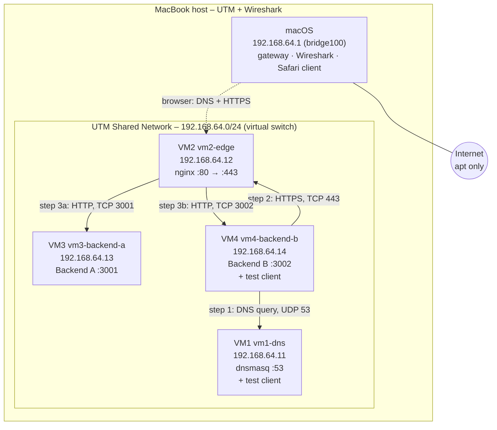
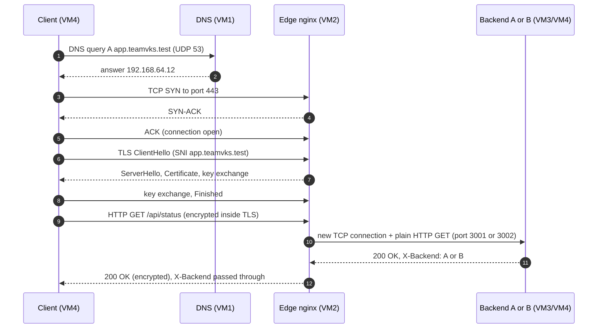

# Architecture

## 1. Goal

A client opens `https://app.teamvks.test` and gets a JSON response from one of two backends. Every hop runs on our own machines:

- our own DNS server answers the name,
- our own edge server terminates TLS,
- our own load balancer picks the backend.

Nothing runs in the cloud. Each component maps to a cloud service in section 6.

## 2. Topology

All four VMs run on one MacBook (Apple Silicon) in UTM. They are attached to UTM's **Shared Network**, a virtual switch (`bridge100` on the Mac) carrying the private subnet `192.168.64.0/24`. The Mac is the gateway (`192.168.64.1`) and NATs the VMs to the internet, which they use only to install packages.

## 3. Inventory

| VM | Role (brief) | Hostname | Interface | IPv4 / prefix | Gateway | MAC | Listening ports |
| --- | --- | --- | --- | --- | --- | --- | --- |
| VM1 | Mac 1 – private DNS + test client | `vm1-dns` | `enp0s1` | 192.168.64.11/24 | 192.168.64.1 | `ce:6c:90:a5:66:5a` | 53/udp, 53/tcp |
| VM2 | Mac 2 – edge proxy + load balancer | `vm2-edge` | `enp0s1` | 192.168.64.12/24 | 192.168.64.1 | `6a:9b:d7:70:ed:9d` | 80/tcp, 443/tcp |
| VM3 | Mac 3 – Backend A | `vm3-backend-a` | `enp0s1` | 192.168.64.13/24 | 192.168.64.1 | `7a:14:d5:23:b0:70` | 3001/tcp |
| VM4 | Mac 4 – Backend B + test client | `vm4-backend-b` | `enp0s1` | 192.168.64.14/24 | 192.168.64.1 | `92:b1:96:9b:dc:31` | 3002/tcp |
| Host | UTM host, capture point, browser client | macOS | `bridge100` | 192.168.64.1/24 | – | `82:a9:97:14:6d:64` | – |

Values are taken from real output in [`A1-inventory.txt`](../evidence/phase1/all-evidence/A-lan-dns/A1-inventory.txt). The MACs are random "locally administered" addresses set in UTM, one per VM.

**Capture points.** UTM's Shared Network behaves like a real switch. `bridge100` is the Mac's own port on it, so Wireshark there only sees broadcasts and traffic to or from the Mac. Each VM has its own switch port on the Mac (`vmenet0`–`vmenet3`, assigned in start order). To see a VM's traffic, capture on its `vmenet` port; `ifconfig bridge100` → *Address cache* shows which MAC sits on which port.

DNS records served by VM1:

| Name | Type | Value | Meaning |
| --- | --- | --- | --- |
| `app.teamvks.test` | A | 192.168.64.12 | the edge, never a backend |
| `api.teamvks.test` | A | 192.168.64.12 | same edge, second name on the same certificate |

`.test` is reserved for testing (RFC 2606), so no public DNS server will ever answer for it. `.local` is avoided because macOS uses it for mDNS.

## 4. Request flow

What happens when VM4 runs `curl https://app.teamvks.test/api/status`:

Key points:

1. **DNS only finds the address.** After step 2 the client knows `192.168.64.12` and DNS plays no further part. DNS is a directory, not a connection.
2. **TCP opens a reliable channel** (steps 3–5) to the edge's well-known port 443 from a random ephemeral client port.
3. **TLS authenticates the edge and encrypts the channel** (steps 6–8). The client checks the certificate against our local CA.
4. **TLS terminates at the edge.** nginx decrypts the request and opens a *separate* plain-HTTP connection to a backend. Client→edge is encrypted; edge→backend is cleartext on the private LAN, which Wireshark shows.
5. **The client never learns backend IPs.** It only knows the name, which maps to the edge. The edge can add, remove or replace backends without any client change, and that is the main job of a load balancer.

## 5. Protocol layer map

| Layer (OSI) | TCP/IP layer | Protocol in this project | Where it shows |
| --- | --- | --- | --- |
| 7 Application | Application | DNS, HTTP/1.1, HTTP/2 | `dig`, `curl -v` headers, `X-Backend` |
| 6 Presentation / 5 Session | (inside Application) | TLS 1.2 / 1.3 | ClientHello, ServerHello, Certificate in Wireshark |
| 4 Transport | Transport | UDP (DNS, port 53), TCP (HTTPS 443, backends 3001/3002) | SYN / SYN-ACK / ACK, seq/ack numbers, ports |
| 3 Network | Internet | IPv4, 192.168.64.0/24 | source/destination IP in every packet, `ping` (ICMP) |
| 2 Data link | Link | Ethernet (virtio NIC on the UTM virtual switch) | MAC addresses in Wireshark, `ip link` |
| 1 Physical | Link | virtual; on a real LAN this is Wi-Fi or cable | – |

## 6. Cloud equivalents

| This project | What it represents in the cloud |
| --- | --- |
| UTM Shared Network 192.168.64.0/24 | a VPC subnet |
| Mac as gateway + NAT (192.168.64.1) | VPC router + NAT gateway |
| dnsmasq on VM1 | Route 53 private hosted zone |
| nginx on VM2 | AWS Application Load Balancer / GCP HTTPS Load Balancer / CDN edge node |
| Backends A and B | EC2 instances in a target group |
| Local CA (OpenSSL) | AWS Private CA / ACM certificate |
| Firewall rules (Phase 2) | security groups |

## 7. Single points of failure (Phase 1)

| Component | If it fails | Fixed in Phase 2 by |
| --- | --- | --- |
| VM1 DNS | names stop resolving (IPs still work) | backup DNS resolver (Extension A) |
| VM2 edge | nothing is reachable by name | standby edge + DNS cutover (Extension E) |
| One backend | the other backend serves all traffic | already tolerated (nginx retries the other upstream) |
